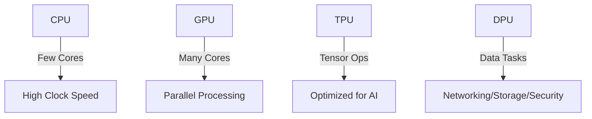
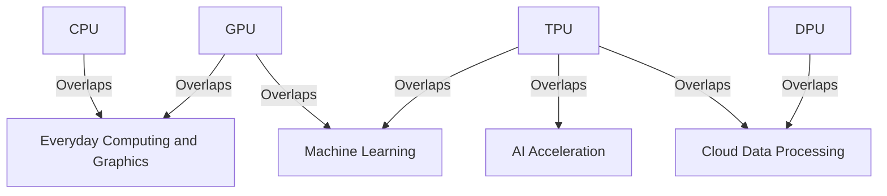

# Understanding CPU, GPU, TPU, and DPU

## 1. **What is a CPU?**
The **Central Processing Unit (CPU)** is the brain of a computer. It performs general-purpose computations and executes instructions from programs. CPUs are optimized for single-threaded performance and are highly versatile, handling various tasks such as running operating systems, applications, and background processes.

### Key Characteristics:
- **Focus**: General-purpose computation.
- **Architecture**: Few cores, high clock speed.
- **Use Cases**: Everyday computing, databases, and single-threaded tasks.

---

## 2. **What is a GPU?**
The **Graphics Processing Unit (GPU)** is specialized for parallel computations. Originally designed for rendering images and videos, GPUs excel at handling large-scale computations with many threads, making them ideal for tasks like deep learning and simulations.

### Key Characteristics:
- **Focus**: Parallel processing.
- **Architecture**: Hundreds to thousands of cores, optimized for matrix and vector operations.
- **Use Cases**: Machine learning, video rendering, simulations.

---

## 3. **What is a TPU?**
The **Tensor Processing Unit (TPU)** is an AI accelerator designed by Google specifically for machine learning workloads. TPUs are optimized for tensor operations, the backbone of neural network computations.

### Key Characteristics:
- **Focus**: Accelerating AI and machine learning models.
- **Architecture**: Optimized for tensor-based computations.
- **Use Cases**: Deep learning training and inference.

---

## 4. **What is a DPU?**
The **Data Processing Unit (DPU)** is a specialized processor designed to handle data-centric tasks such as networking, security, and storage. DPUs offload these tasks from the CPU, improving system performance and efficiency.

### Key Characteristics:
- **Focus**: Data movement and processing.
- **Architecture**: Integrates networking, storage, and security capabilities.
- **Use Cases**: Cloud computing, high-performance data centers, and networking.

---

## Comparison of CPU, GPU, TPU, and DPU

| Component | Focus                 | Architecture                | Use Cases                                |
|-----------|-----------------------|-----------------------------|------------------------------------------|
| CPU       | General-purpose       | Few cores, high clock speed | Everyday computing, databases            |
| GPU       | Parallel processing   | Many cores                  | Deep learning, simulations               |
| TPU       | AI acceleration       | Tensor-optimized            | Machine learning training and inference  |
| DPU       | Data-centric tasks    | Networking, storage, security | Cloud and data center optimization       |

---

## Visualizations

### Diagram 1: Architecture Comparison


### Diagram 2: Use Case Overlap


---

### Graph: Performance vs Specialization
```mermaid
line
    title Performance vs Specialization
    axisX Specialization -->
    axisY Performance -->
    "CPU": (0.2, 0.4)
    "GPU": (0.6, 0.8)
    "TPU": (0.8, 1.0)
    "DPU": (0.7, 0.9)
